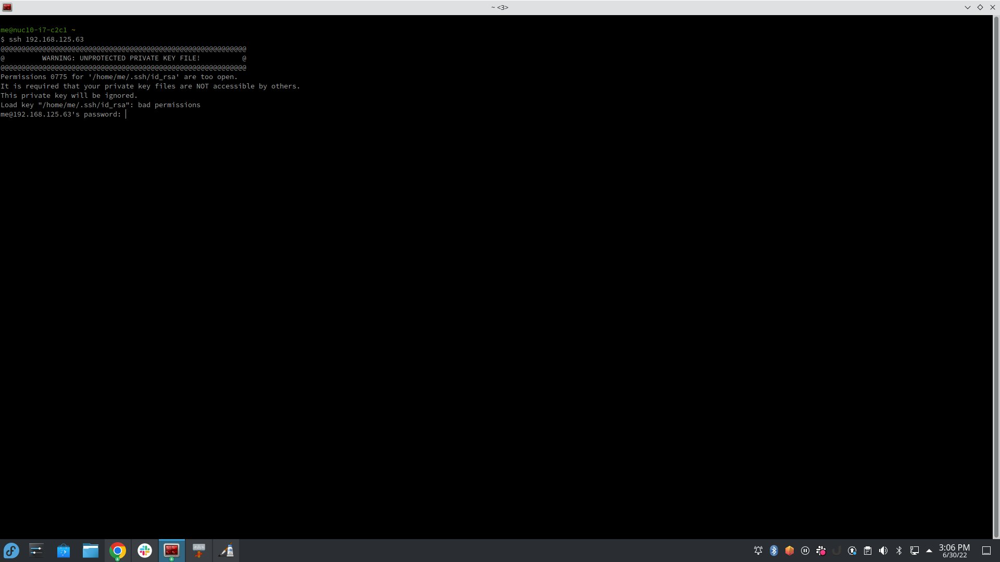

# Curso_git
**Aprenda do básico ao avançado Git e GitHub**, uma abordagem prática para o controle de versão e manutenção de repositórios.

## Funcionalidades

*Informar sobre os conteudos do git*.

### Linguagens do projeto:

* HTML
* CSS
* JavaScript

### Funcionalidades a desenvolver

1. Ada
   1. ABDBC
   2. ASOd
2. ADe
3. ASW

### Imagem local

### Imagem externa

### Links interessantes

[Googl](https://www.google.com/)

[https://www.google.com/](https://www.google.com/)

Google: https://www.google.com/

